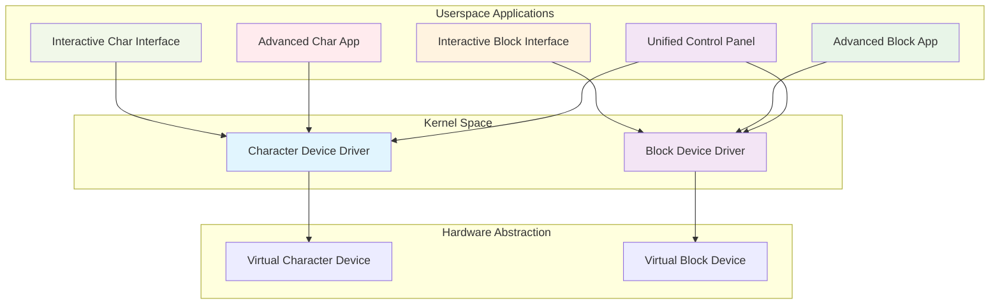
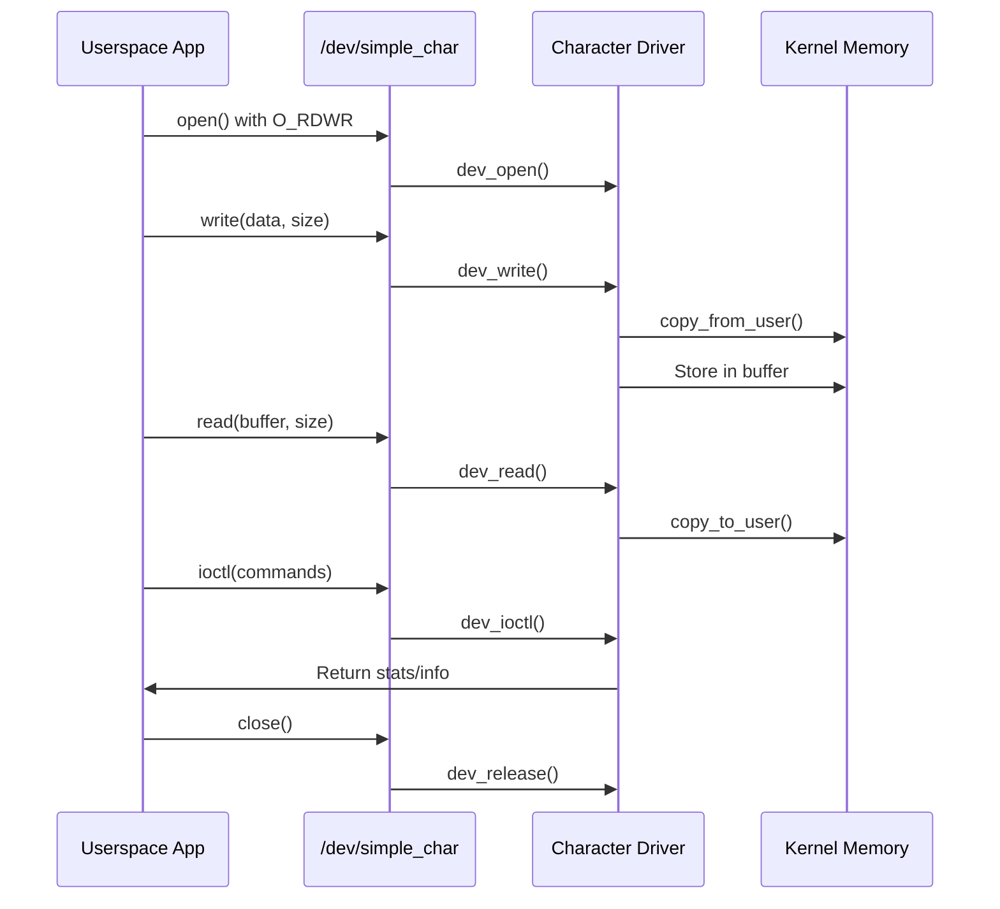
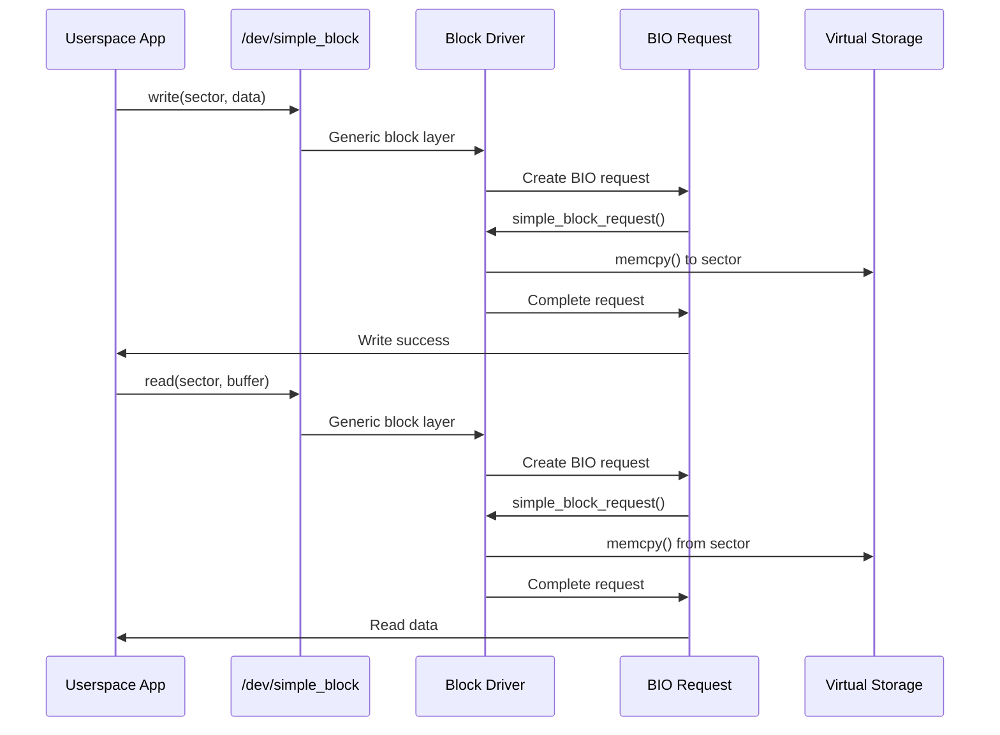
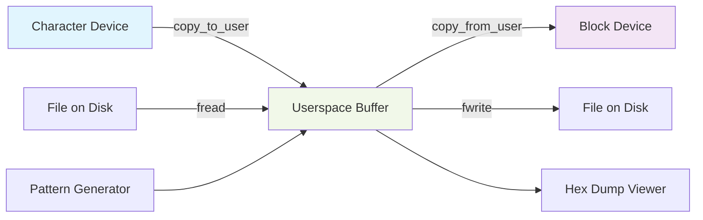
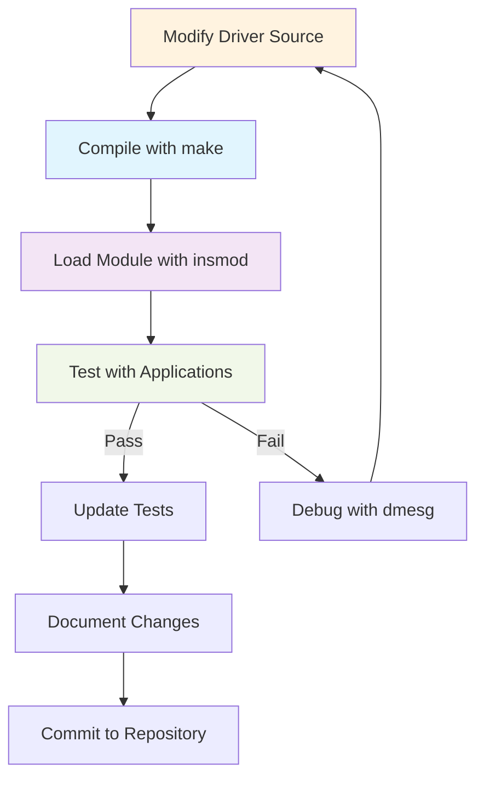

# Virtual Character & Block Device Drivers Project


##  Project Overview

A comprehensive Linux kernel module project demonstrating **virtual character** and **block device drivers** with advanced userspace applications for testing, benchmarking, and management. This project serves as an educational resource for understanding Linux device driver development and userspace-kernel communication.

##  Features

### **Character Device Driver** (`/dev/simple_char`)
-  Dynamic buffer allocation with resizing
-  Thread-safe operations with mutex locks
-  IOCTL support for device control
-  Statistics tracking (read/write counts)
-  Seek operations support
-  User-kernel data transfer safety

### **Block Device Driver** (`/dev/simple_block`)
-  Configurable device size (up to 32MB)
-  Sector-based I/O operations (512 bytes/sector)
-  Request queue handling
-  Performance statistics tracking
-  Support for standard block device ioctls
-  Virtual storage emulation

### **Userspace Applications**
- **Interactive Character Interface** - Menu-driven character device manager
- **Interactive Block Interface** - Sector-level block device operations
- **Advanced Character App** - Feature-rich testing and benchmarking
- **Advanced Block App** - Comprehensive disk operations and testing
- **Unified Control Panel** - Combined interface for both devices

##  Architecture Overview



##  Project Structure

```
virtual_drivers_project/
├── Makefile                    # Top-level build system
├── README.md                   # This file
├── char_driver/                # Character device driver
│   ├── Makefile               # Driver build system
│   ├── simple_char.c          # Character driver source
│   ├── char_interface.c       # Interactive character app
│   └── test_char.c           # Basic test program
├── block_driver/              # Block device driver
│   ├── Makefile              # Driver build system
│   ├── simple_block.c        # Block driver source
│   ├── block_interface.c     # Interactive block app
│   └── test_block.c          # Basic test program
└── apps/                      # Advanced applications
    ├── Makefile              # Applications build system
    ├── char_app.c           # Advanced character application
    ├── block_app.c          # Advanced block application
    └── unified_app.c        # Unified control panel
```

##  Prerequisites

### System Requirements
- **Linux Kernel**: 4.4 or higher (tested on 5.x)
- **GCC**: 7.0 or higher
- **Make**: 4.0 or higher
- **Kernel Headers**: Installed for your kernel version
- **Root Access**: Required for module loading

### Install Dependencies
```bash
# Ubuntu/Debian
sudo apt-get update
sudo apt-get install build-essential linux-headers-$(uname -r)

# Fedora/RHEL/CentOS
sudo dnf install gcc make kernel-devel

# Arch Linux
sudo pacman -S base-devel linux-headers
```

##  Quick Start Guide

### 1. Clone and Build
```bash
# Clone the repository (if applicable)
# git clone <repository-url>
# cd virtual_drivers_project

# Build everything
make all
```

### 2. Install and Load Drivers
```bash
# Install drivers and create device nodes
sudo make install

# Or manually:
# Load character driver
sudo insmod char_driver/simple_char.ko

# Load block driver  
sudo insmod block_driver/simple_block.ko

# Create device nodes
sudo mknod /dev/simple_char c 240 0
sudo mknod /dev/simple_block b 241 0
sudo chmod 666 /dev/simple_char /dev/simple_block
```

### 3. Verify Installation
```bash
# Check loaded modules
lsmod | grep simple

# Check device nodes
ls -la /dev/simple_*

# View kernel messages
dmesg | tail -20
```

### 4. Run Basic Tests
```bash
# Test character driver
make test

# Or manually:
cd char_driver
make test

# Test block driver
cd block_driver
make test
```

##  Detailed Usage

### Interactive Character Device Interface
```bash
sudo ./char_driver/char_interface
```
**Features:**
- Write/Read operations with position control
- Hex dump viewer
- Buffer statistics
- Pattern testing
- Concurrent access testing

### Interactive Block Device Interface
```bash
sudo ./block_driver/block_interface
```
**Features:**
- Sector-level read/write operations
- Pattern filling and verification
- Disk scanning
- Performance benchmarking
- Concurrent sector operations

### Advanced Applications
```bash
# Advanced character operations
sudo ./apps/char_app

# Advanced block operations
sudo ./apps/block_app

# Unified control panel
sudo ./apps/unified_app
```

##  Workflow Diagrams

### 1. Character Device Workflow


### 2. Block Device Workflow


### 3. Data Transfer Between Devices


##  Testing Commands

### Basic Operations
```bash
# Write to character device
echo "Hello Driver" | sudo tee /dev/simple_char

# Read from character device
sudo cat /dev/simple_char

# Write to block device (sector 0)
echo "Test Data" | sudo dd of=/dev/simple_block bs=512 count=1

# Read from block device
sudo dd if=/dev/simple_block bs=512 count=1 | hexdump -C
```

### Performance Testing
```bash
# Character device benchmark
sudo ./apps/char_app
# Choose option 4 (Benchmark)

# Block device benchmark
sudo ./apps/block_app
# Choose option 6 (Benchmark)

# Concurrent testing
sudo ./apps/unified_app
# Choose option 4 (Performance Testing)
# Then option 3 (Concurrent test)
```

### Diagnostic Commands
```bash
# Monitor kernel messages
sudo dmesg -w

# Check driver statistics
sudo cat /proc/modules | grep simple

# View device major numbers
cat /proc/devices | grep simple

# Check system resources
top -p $(pidof char_app)  # For running apps
```

##  Troubleshooting Guide

### Common Issues and Solutions

| Issue | Solution |
|-------|----------|
| **Permission denied** | `sudo chmod 666 /dev/simple_char /dev/simple_block` |
| **Module not found** | `sudo depmod -a` then `sudo modprobe simple_char` |
| **Major number conflict** | Check `/proc/devices` and modify driver source |
| **Buffer allocation failed** | Check memory with `free -h`, reduce buffer size |
| **Device node missing** | `sudo mknod /dev/simple_char c 240 0` |
| **Kernel panic** | Reboot and check kernel compatibility |

### Debugging Steps
```bash
# Step 1: Check kernel messages
dmesg | tail -50

# Step 2: Verify module loading
lsmod | grep simple

# Step 3: Check device nodes
ls -la /dev/simple_*

# Step 4: Test basic functionality
echo "test" | sudo tee /dev/simple_char
sudo cat /dev/simple_char

# Step 5: Check system logs
journalctl -k -f
```

##  Performance Metrics

### Expected Performance
| Operation | Character Device | Block Device |
|-----------|-----------------|--------------|
| **Sequential Read** | 200-500 MB/s | 100-300 MB/s |
| **Sequential Write** | 150-400 MB/s | 80-250 MB/s |
| **Random Read** | 50-200 MB/s | 10-50 MB/s |
| **Random Write** | 40-150 MB/s | 8-40 MB/s |
| **Latency** | < 1ms | 1-5ms |

### Benchmark Results Example
```bash
# Sample benchmark output
╔══════════════════════════════════════════════════════════╗
║                    BENCHMARK RESULTS                     ║
╚══════════════════════════════════════════════════════════╝
Test configuration:
  Data size:      1024 KB
  Iterations:     100
  Total data:     100.00 MB

Character device:
  Write speed:     342.15 MB/s
  Read speed:      387.42 MB/s
  Latency:         0.85 ms/op

Block device:
  Write speed:     215.73 MB/s  
  Read speed:      278.91 MB/s
  Latency:         2.34 ms/op
```

##  Development Workflow



### Development Commands
```bash
# Build specific component
make char          # Build character driver only
make block         # Build block driver only
make apps          # Build applications only

# Clean build
make clean

# Full rebuild
make clean all

# Install/uninstall
sudo make install
sudo make uninstall

# Run demo
make demo
```

##  Educational Value

### Learning Objectives
1. **Linux Kernel Programming**: Understand kernel module development
2. **Device Driver Architecture**: Learn character vs block device differences
3. **Userspace-Kernel Communication**: Master data transfer mechanisms
4. **Concurrency in Drivers**: Implement thread-safe operations
5. **Performance Optimization**: Benchmark and optimize driver performance
6. **Debugging Techniques**: Learn kernel debugging strategies

### Key Concepts Demonstrated
- **File Operations Structure**: Implementing open, read, write, release
- **IOCTL Interface**: Custom command implementation
- **Memory Management**: kmalloc, vmalloc, copy_to/from_user
- **Synchronization**: Mutex locks for thread safety
- **Block Layer Integration**: Request queues and BIO structures
- **Userspace Interfaces**: Creating intuitive testing applications

##  API Reference

### Character Device IOCTL Commands
| Command | Description | Parameter |
|---------|-------------|-----------|
| `CHAR_GET_SIZE` | Get buffer size | `int*` |
| `CHAR_RESET_BUFFER` | Clear buffer | None |
| `CHAR_GET_STATS` | Get statistics | `struct char_stats*` |
| `CHAR_SET_BUFFER_SIZE` | Resize buffer | `int*` |

### Block Device Operations
| Operation | Sector Alignment | Typical Use |
|-----------|-----------------|-------------|
| **Read** | 512-byte boundary | Data retrieval |
| **Write** | 512-byte boundary | Data storage |
| **Seek** | Any position | Random access |
| **Pattern Fill** | Multiple sectors | Testing |

##  Contributing

### Development Guidelines
1. Follow Linux kernel coding style
2. Add comments for complex logic
3. Include error handling
4. Update documentation
5. Test thoroughly before submission

### Code Style
```c
// Good example
static int dev_open(struct inode *inodep, struct file *filep)
{
    printk(KERN_INFO "Device opened by process %d\n", current->pid);
    return 0;
}

// Use proper error handling
if (!device_buffer) {
    printk(KERN_ALERT "Memory allocation failed\n");
    return -ENOMEM;
}
```

##  License

This project is licensed under the **GNU General Public License v3.0** - see the [LICENSE](LICENSE) file for details.

```
Virtual Character & Block Device Drivers Project
Copyright (C) 2024 Your Name

This program is free software: you can redistribute it and/or modify
it under the terms of the GNU General Public License as published by
the Free Software Foundation, either version 3 of the License, or
(at your option) any later version.

This program is distributed in the hope that it will be useful,
but WITHOUT ANY WARRANTY; without even the implied warranty of
MERCHANTABILITY or FITNESS FOR A PARTICULAR PURPOSE. See the
GNU General Public License for more details.
```

##  Acknowledgments

- Linux Kernel Documentation
- Linux Device Drivers, 3rd Edition (O'Reilly)
- Kernel Newbies community
- All open-source contributors to Linux driver development

## 📞 Support

For issues, questions, or contributions:
1. Check the troubleshooting section
2. Review kernel messages with `dmesg`
3. Examine the code comments
4. Create an issue in the repository

---

<div align="center">
  <h3>🌟 Star this project if you find it useful! 🌟</h3>
  
  <p>
    <a href="#virtual-character--block-device-drivers-project">Back to top</a>
  </p>
  
  <p>
    <em>Built with ❤️LOVE for the Linux kernel community</em>
  </p>
</div>


##  Important Notes

### Safety Warnings
1. ⚠️ **Always test in a virtual machine** or development environment
2. ⚠️ **Backup important data** before testing
3. ⚠️ **Use sudo carefully** - this project requires root privileges
4. ⚠️ **Monitor system resources** during stress tests

### Compatibility
- Tested on: Ubuntu 20.04+, Fedora 32+, CentOS 8+
- Kernel versions: 4.4 - 5.15
- Architecture: x86_64, arm64 (untested but should work)

### Future Enhancements
- [ ] Network device driver integration
- [ ] DMA support for block device
- [ ] Power management features
- [ ] Security enhancements
- [ ] Additional filesystem support

---
🐧
